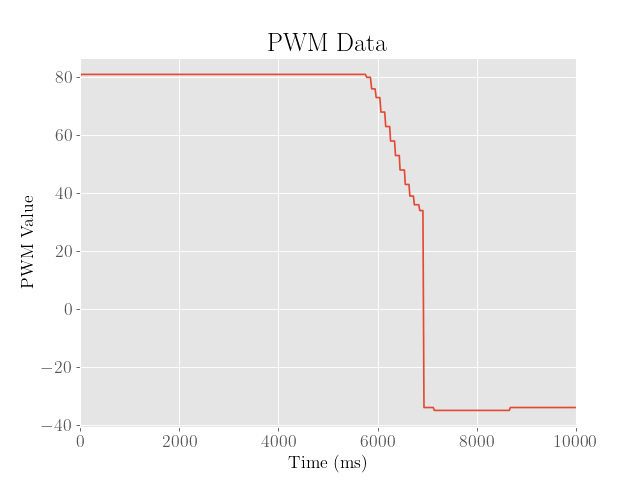

The objective of this lab was to implement a simple PID controller for the robot, which controlled the robot's position from a wall at a setpoint of 1 foot (roughly 304 mm) from the wall. 

## Setup:

To facilitate the debugging and data analysis process, a simple Bluetooth codebase was created to ensure that the Artemis board would periodically send timestamped arrays of sensor data, including the ToF, IMU, motor PWM levels, and PID controller parameters. 

To store the data, separate arrays for each kind of data were created with a maximum size set safely below the maximum dynamic memory storage capacity of the Artemis board. 

```cpp
if (myICM.dataReady() && distanceSensor1.checkForDataReady() && distanceSensor2.checkForDataReady() && idx < MAX_SIZE) {
    myICM.getAGMT();
      
    // Time
    t[idx] = int(millis());

    // IMU
    ax[idx] = (&myICM)->accX();
    ay[idx] = (&myICM)->accY();
    az[idx] = (&myICM)->accZ();
    gx[idx] = (&myICM)->gyrX();
    gy[idx] = (&myICM)->gyrY();
    gz[idx] = (&myICM)->gyrZ();

      // ToF
    int distance1 = distanceSensor1.getDistance();
    int distance2 = distanceSensor2.getDistance();
    d1[idx] = distance1;
    Serial.print("D1: ");
    Serial.println(distance1);
    d2[idx] = distance2;
    Serial.print("D2: ");
    Serial.println(distance2);

    // Motor
    ml[idx] = pwml;
    mr[idx] = pwmr;
     
    prev = idx;
    idx = (idx+1)%MAX_SIZE;
}
```

Once the data was received on the laptop, it was subsequently processed into arrays in Python and then saved into a PKL file for future analysis:

```python
async def get_data(uuid,byte_array):
    global time_millis
    global acc_mg, gyr_dps, depth1_mm, depth2_mm, temp5s_str
    global kp, ki, kd, motorl, motorr
    MAX_SIZE = 1000
    vecfloat = np.vectorize(lambda x: float(x[3::]))
    
    # parse string
    temp5s_str = ble.bytearray_to_string(byte_array)
    temp5s_list = temp5s_str.split("|")
    mode = temp5s_list[0]
    time = temp5s_list[1]
    
    if int(mode):
        a,g,d = temp5s_list[2:5],temp5s_list[5:8],temp5s_list[8:10]
        time_millis.append(int(time[2::]))
        if len(acc_mg) == 0:
            acc_mg = np.reshape(vecfloat(a),(3,1))
        else:
            acc_mg = np.hstack((acc_mg,np.reshape(vecfloat(a),(3,1))))
        if len(gyr_dps) == 0:
            gyr_dps = np.reshape(vecfloat(g),(3,1))
        else:
            gyr_dps = np.hstack((gyr_dps,np.reshape(vecfloat(g),(3,1))))
        depth1_mm.append(int(d[0][3::]))
        depth2_mm.append(int(d[1][3::]))
    else:
        p,i,d = temp5s_list[1:4]
        m = temp5s_list[4:6]
        kp.append(float(p[3::]))
        ki.append(float(i[3::]))
        kd.append(float(d[3::]))
        motorl.append(int(m[0][3::]))
        motorr.append(int(m[1][3::]))
        
    # save data 
    if len(motorl) >= MAX_SIZE:
        plotData()
        with open(filename, 'ab') as file:
            pickle.dump([time_millis,acc_mg,gyr_dps,depth1_mm,depth2_mm,kp,ki,kd,motorl,motorr], file)
        time_millis = []
        acc_mg,gyr_dps,depth1_mm,depth2_mm = [],[],[],[]
        kp,ki,kd,motorl,motorr = [],[],[],[],[]
        temp5s_str = ''
```

Unfortunately, compiling all of the code and dependencies needed to facilitate Bluetooth communication on the Artemis required inconveniently large compile times, which could potentially last several minutes. 

This would make testing various PID parameters somewhat painfully slow and inefficient, which is especially inconvenient since manually tuning the controller to achieve optimized rise times and overshoot would require many repeated trials of precise gain adjustments.

To circumvent this issue, a set of Bluetooth commands was developed that could be activated via keyboard commands on the laptop, including simple commands for remote control access, activating the PID loop, and tuning PID parameters:

```python
keyboard_input = keyboard.read_key()
# movement using the WASD keys
if keyboard_input == "w":
    ble.send_command(CMD.FWD, "")
elif keyboard_input == "s":
    ble.send_command(CMD.BWD, "")
elif keyboard_input == "a":
    ble.send_command(CMD.LEFT, "")
elif keyboard_input == "d":
    ble.send_command(CMD.RIGHT, "")
elif keyboard_input == "space":
    ble.send_command(CMD.STOP, "")

# PWM (or PID) tuning using the arrow keys
elif keyboard_input == "up":
    ble.send_command(CMD.PID_CONTROL , "")
elif keyboard_input == "down":
    ble.send_command(CMD.STOP, "")
    ble.send_command(CMD.SEND , "")
elif keyboard_input == "p":
    x = input()
    ble.send_command(CMD.SET_KP, x)
    ble.send_command(CMD.STOP, "")
elif keyboard_input == "i":
    x = input()
    ble.send_command(CMD.SET_KI, x)
    ble.send_command(CMD.STOP, "")
elif keyboard_input == "c":
    x = input()
    ble.send_command(CMD.SET_KD, x)
    ble.send_command(CMD.STOP, "")
```

The use of the nonstandard keyboard module and the general outline of the Python code was heavily inspired by the helpful template script provided by Raphael Fortuna, who generously shared this idea and provided a code template to help make the testing session somewhat more bearable.

## P Controller:

Due to the nature of the ToF measurements, which might range up to a a couple meters away (~1.3 m for the short range mode), and given that the motor PWM values (excluding the deadband range from 0 to 40) range to about 215, we would expect that a reasonable proportional error gain should be no more than about 0.165 (215/1300).

In fact, we might want to typically aim for PWM values of around 100 or less, which might suggest the need for even lower gains, but this will highly depend on the distance from the wall and the contributions of the other error terms in the PID controller.

To implement the PID controller, the following function was used as the PID loop for the robot:

```cpp
float sum_error = 0;
float prev_error = 0;
float f_diff_error  = 0;
void pidcontrol(){ 
  float setpoint = 304;
  float windup_cap = 1000;
  float error = d2[previdx]-setpoint;
  if (abs(sum_error + error) <= windup_cap) {
    sum_error += error;
  }
  
  float alpha = 0.25;
  float diff_error = error - prev_error;
  prev_error = error;
  f_diff_error = alpha*diff_error + (1-alpha)*f_diff_error; 
  
  float p_term = KP*error;
  float i_term = KI*sum_error;
  float d_term = KD*f_diff_error;
  int pwm = round(p_term + i_term + d_term);
  if (abs(pwm) <= 3){
    analogWrite(A15,0);
    analogWrite(A16,0);
    analogWrite(4,0);
    analogWrite(A5,0);
  } else{
    pwml = pwm;
    pwmr = pwm;
    writepwm(pwml,pwmr);
  }
}
```

Note that we assume a constant and fast sampling rate, so the discrete sum of errors approximates the integral term and the discrete difference of errors approximates the derivative term. In hindsight, this is not really an accurate assumption, as the time between each sample (about 16 milliseconds) has a standard deviation of about 3-4 milliseconds. 

This in turn would mean an error of about 20-25%, which means that the sums and differences are pretty poor approximations to the actual integral and derivative. Fortunately, this isn't as much of a problem if the integral gains are tuned low enough and the derivative error is sufficiently filtered.

The loop relies on a helper function used to write PWM values to the motors:

```cpp
void writepwm(int l,int r){
    float alpha = 0.05;
    if (l >= 0) {
      analogWrite(A15,0);
      analogWrite(A16,rescalepwm(calibratepwm(l, alpha)));
    } else {
      analogWrite(A15,rescalepwm(calibratepwm(-l, alpha)));
      analogWrite(A16,0);
    }
    if (r >= 0) {
      analogWrite(4,0);
      analogWrite(A5,rescalepwm(calibratepwm(r, -alpha)));
    } else {
      analogWrite(4,rescalepwm(calibratepwm(-r, -alpha)));
      analogWrite(A5,0);
    }     
}
```

Furthermore, to ensure that the PWM values would be rescaled outside of the motor's deadband regime, as well as to ensure that the values were calibrated to help to robot move straight, and to clip values outside of the maximum magnitude of 255, the following helper functions were used:

```cpp
int rescalepwm(float pwm){
  float deadband = 40;
  return round((pwm+deadband)*215.0/255.0);
}

float calibratepwm(float pwm, float alpha){
  return clippwm(pwm*(1+alpha));
}

int clippwm(int pwm){
  if (abs(pwm) >= 255) return 255;
  else return pwm;
}
```

To tune the controller, we tune the proportional and integral gains first to gauge the minimum gain values that lead to instability. The derivative term is then set afterwards to reduce overshoot and make the controller robust to disturbances.

Following this heuristic, the proportional error gain was first adjusted such that the robot would begin to oscillate around the setpoint of 304 mm, where the other gain values were set to 0. 

This occured at around a gain of 0.2, as shown in the following:

<iframe width="560" height="315" src="https://www.youtube.com/embed/u1uavWQutMg" title="YouTube video player" frameborder="0" allow="accelerometer; autoplay; clipboard-write; encrypted-media; gyroscope; picture-in-picture; web-share" allowfullscreen></iframe>


From here it is clear that the robot manages to get close to the desired setpoint of 304 mm, but ends up at around 50 mm away from the desired setpoint.

We also observe that on the second time it passes the setpoint, it approaches the wall much slower than before, which is likely due to the low amounts of error.

To provide a larger kick to the motors in the case where the robot strays too far from the setpoint for too long, an integral term might be more desirable.

## PI Controller:

In tuning the PI controller, the proportional gain was scaled back by half to 0.1, and the integral gain was then increased until a loss of stability was achieved.

This occurred at around a gain of 0.02:

<iframe width="560" height="315" src="https://www.youtube.com/embed/XdIC6-nzy8w" title="YouTube video player" frameborder="0" allow="accelerometer; autoplay; clipboard-write; encrypted-media; gyroscope; picture-in-picture; web-share" allowfullscreen></iframe>


As shown in above, we see that the robot demonstrates significant oscillations around the setpoint, and approaches the setpoint somewhat faster.

Furthermore, we note that although the integral error was carefully clamped to a maximum value to prevent integral windup issues, the integral term was enough to build up momentum such that the robot would severely overshoot the setpoint to the point of crashing into the wall. 

To address this, a derivative term was then added, which could hopefully reduce the motor speeds the faster the error decreases.

## PID Controller:

To tune the fully fledged PID controller, the integral gain was scaled back by half to 0.01, and the derivative gain was set to around 0.3:

<iframe width="560" height="315" src="https://www.youtube.com/embed/GQAxQiuP1vI" title="YouTube video player" frameborder="0" allow="accelerometer; autoplay; clipboard-write; encrypted-media; gyroscope; picture-in-picture; web-share" allowfullscreen></iframe>


We then see that the robot is now somewhat closer to the setpoint within about 20 mm, but seems to overshoot the final value by about 130 mm. We also observe that the robot moves slower backwards to the setpoint at the peak of the overshoot, suggesting that the controller can still be improved.

## Optimizations:

To improve the controller, the heuristic was repeated a couple more times to find more optimal gain values and to maybe find a general pattern in how the gain values affect the dynamics:

 First Iteration                            | Second Iteration                   | Third Iteration                                  | Fourth Iteration                                        |
|:-----------------------------------------:|:----------------------------------:|:------------------------------------------------:|:--------------------------------------------------------|
||||

For reference, we also include the motor PWM values (after rescaling and including sign):

 First Iteration                | Second Iteration               | Third Iteration                | Fourth Iteration              |
|:-----------------------------:|:------------------------------:|:------------------------------:|:-----------------------------:|
||||

Note that the periods of stillness at the beginning and end have meaningless PWM values since the PID loop was not active during those intervals of time.

As shown above, after the second iteration, the overshoot was somewhat reduced by about 50 mm, which is somewhat due to the lower proportional and integral gains and higher derivative gain. However, we also see that the final error is somewhat larger.

Because both the overshoot and final error are both somewhat significant, a third iteration was executed, where the robot then reaches the setpoint with virtually no overshoot whatsoever. Despite this, the final error from the setpoint was about 100 mm, which was far too large.

Because the controller already achieved a desirable overshoot, the proportional and integral gains were then kicked back to ensure that the robot approaches the setpoint slower and more accurately, and the derivative gain was increased to slow down near the setpoint. 

Although increasing the derivative gain did help reduce the overshoot, the noise in the derivative of error caused the robot to oscillate and twitch, even after reaching the setpoint. 

To address this, a complementary filter with $$\alpha = 0.25$$ was implemented to weigh the previous differences of error more heavily.

We then find after the fourth iteration, the robot approaches the setpoint accurately with minimal overshoot. While this is already quite desirable as a controller, the slow rise time of about a full second is still somewhat suboptimal.

The final PID controller was then tuned to higher proportional and integral gains to speed up to the setpoint, and then the derivative gain was adjusted the minimum value needed to minimize the overshot value:

<iframe width="560" height="315" src="https://www.youtube.com/embed/sBuXXbXm2mE" title="YouTube video player" frameborder="0" allow="accelerometer; autoplay; clipboard-write; encrypted-media; gyroscope; picture-in-picture; web-share" allowfullscreen></iframe>


Admittedly, the final error from the setpoint is still around 50 mm, suggesting a tradeoff between accuracy and speed of the controller.

The parameters for each iteration, including the final optimized controller, are shown below:

| Iteration | KP     | KI     | KD   | Overshoot (mm) | Final Error (mm) |
| --------- | ------ | ------ | ---- | -------------- | ---------------- |
| 1         | 0.1000 | 0.0100 | 0.30 | 130            | 20               |
| 2         | 0.0900 | 0.0075 | 0.35 | 82             | 68               |
| 3         | 0.1125 | 0.0050 | 0.50 | 0              | 103              |
| 4         | 0.1000 | 0.0025 | 1.00 | 8              | 0                |
| 5         | 0.1525 | 0.0045 | 0.26 | 1              | 45               |

# Robustness:

Finally, we note that the above tests only demonstrate the performance of the controller at initial position of within a meter from the wall on a carpeted floor. 

We first verify that the robot's performance was robust over longer distances (~2 m) from the wall:

<iframe width="560" height="315" src="https://www.youtube.com/embed/i0BeqN5DeG4" title="YouTube video player" frameborder="0" allow="accelerometer; autoplay; clipboard-write; encrypted-media; gyroscope; picture-in-picture; web-share" allowfullscreen></iframe>


Next, we demonstrate the performance on a smoother surface, where friction is somewhat reduced:

<iframe width="560" height="315" src="https://www.youtube.com/embed/2niU6rWtvDo" title="YouTube video player" frameborder="0" allow="accelerometer; autoplay; clipboard-write; encrypted-media; gyroscope; picture-in-picture; web-share" allowfullscreen></iframe>


From here we observe the overshoot and final error from the setpoint are both worse, which intuitively makes sense since the loss of friction makes the robot more prone to slipping. To address this issue, the proportional and integral gains could be reduced, whereas the derivative gain could be increased, which would trade speed for accuracy.

## Speed:

To estimate the sampling rate of the robot, the first order differences of the array of timestamps were averaged, which came out to about 16 milliseconds between each sample. This in turn corresponds to a sampling rate of a little over 60 Hz. 

While this isn't exactly slow, it is currently pushing the maximum performance of the robot and ultimately does set a hard limit to how fast the robot can respond to system disturbances. The robot can only sample slower, and needs to trade off the accuracy of the integral and derivative terms for the sampling rate.

Furthermore, while this wasn't explored for this lab, a faster sampling rate might be attained with the time of flight sensors by reducing the integration time (exposure time to light). This in turn would yet again trade the accuracy of the sensor measurements for speed. 

To measure the maximum speed of the robot under the optimized PID controller, the average velocity was determined by taking the slope between the points where the robot lies at 90% of the initial error to 10% of the initial error. This was done to ensure that the slope was taken over the linear regime of the graph, which would hopefully be more faithful to the maximum rate the robot could travel.

As shown in the plot below, this came out to around 676 mm/s:


To find the maximum uncontrolled speed of the robot, a simple test was conducted while the robot was run under the maximum PWM values (255), which yielded a speed of 2072 mm/s:


From here we note that while the robot already does move quite fast under the controller, it is still well below the maximum possible speed.

However, as previously mentioned, the maximum speed of mm/s may not be desirable in environments where friction is limited, as the robot will tend to overshoot the setpoint more.

A more optimal controller might be obtained by applying a more sophisticated controller with knowledge about the system dynamics, such as an LQR or LQG controller.

